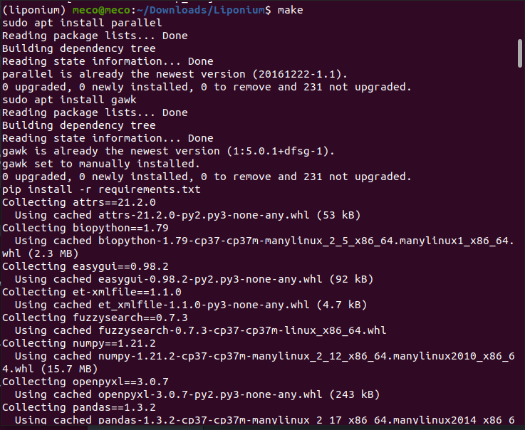

# MTB-Heteroresistence

---

## 1. Download the Liponium repository [here](https://github.com/mecomontes/MTB-Heteroresistence)

<div align ="center "></div>
---

## 2. Extract Liponium folder on your local machine in the same folder that your fastq files.

---
## 3. Move to Liponium folder in your machine and open a terminar (CLI).

<div align ="center "></div>
---

## 4. Create a virtual enviroment for Liponium app:
```
conda create -n liponium python=3.7
```
and type y (yes)

<div align ="center "></div>
---

## 5. Activate the Liponium enviroment:
```
conda activate liponium
```
<div align ="center "></div>
---

## 6. Install modules, libraries, and all the necessary dependencies:
```
pip install -r requirements.txt
```
<div align ="center "></div>
---

## 7. Run Liponium app:
```
./Liponium.py
```
<div align ="center "></div>
---

## 8. Liponium creates 3 different reports in the same folder.

<div align ="center "></div>
---

Reference.xlsx: An EXCEL file that contains the initial info inputed.

Unmerged.xlsx: An EXCEL file with the result after aplying the Liponium searching. 

Merged.xlsx: Its a full report with that merged the initial info (Reference.xlsx) with the generated data (Unmerged.xlsx).

<div align ="center "></div>
---

## 9. Deactivate the enviroment (Optional):
```
conda deactivate
```
---

## Authors

* **Robinson Montes** - [mecomonteshbtn](https://github.com/mecomontes)
* **Felipe** - [felipe](https://github.com/mecomontes)
